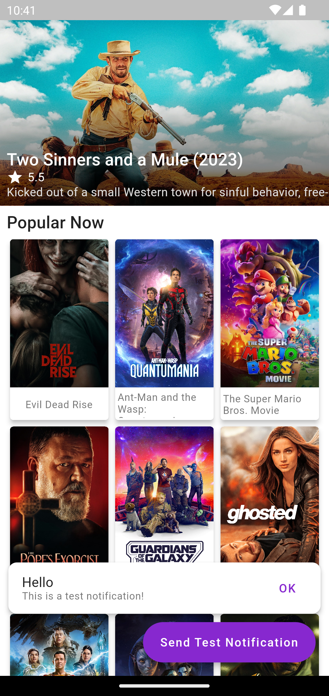
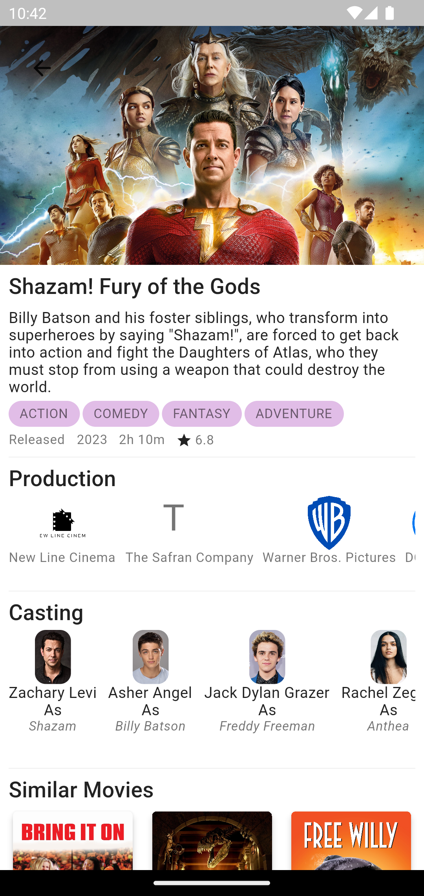
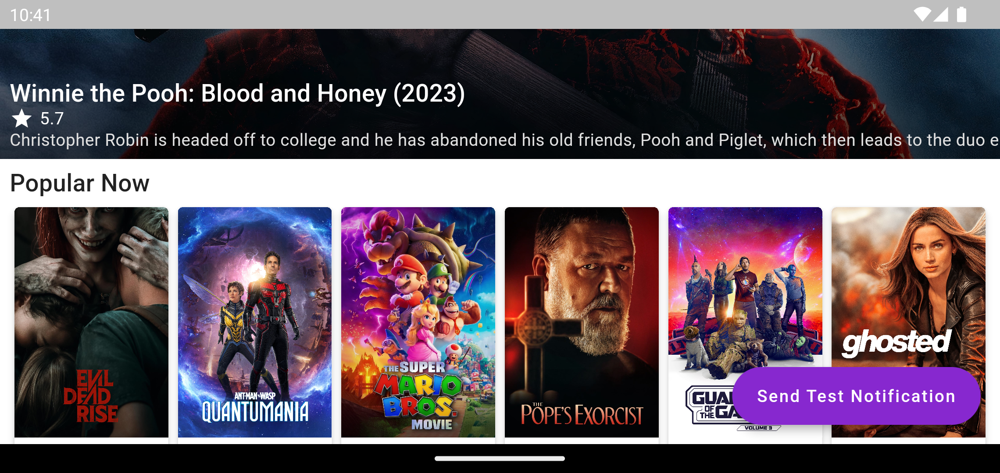

# movie_library

An implementation of the [The movie db API](https://developer.themoviedb.org/reference/intro/getting-started) in Flutter.

<!-- # Demo
  -->
# Screenshots
<div class="row">
</img>
</img>
</img>
</div>

# How to use
## Step 1:
Clone this repository
```
git clone git@github.com:sharmashashi/movie_library.git
```

## Step 2:
Goto the project root and get the dependencies
```
cd movie_library && flutter pub get
```

## Step 3:
This project uses riverpod with code generation and generated files are not included in repository. Run the following command to generate missing libraries
```
flutter packages pub run build_runner build --delete-conflicting-outputs
```

## Step 4:
At the root of the project, create .env file that contains your `movie_db_auth_token` and `fcm_server_key`. See `.env.example`. Please read [FCM documentation](https://firebase.google.com/docs/cloud-messaging/auth-server) to get your server key.

## Step 5:
Configure your firebase project. Kindly read [flutterfire documentation](https://firebase.flutter.dev/docs/overview/).

## Step 6:
Run the project
```
flutter run
```

# Folder Structure
```
lib/
┣ core/
┃ ┣ configs/
┃ ┃ ┗ configs.dart
┃ ┣ models/
┃ ┃ ┗ paginated_data.dart
┃ ┣ services/
┃ ┃ ┣ fcm/
┃ ┃ ┗ http/
┃ ┣ utils/
┃ ┃ ┣ extensions.dart
┃ ┃ ┗ utils.dart
┃ ┗ widgets/
┃   ┣ movie_card.dart
┃   ┗ snackbar.dart
┣ features/
┃ ┣ fcm/
┃ ┃ ┣ providers/
┃ ┃ ┣ repositories/
┃ ┃ ┗ widget/
┃ ┣ movie_details/
┃ ┃ ┣ models/
┃ ┃ ┣ providers/
┃ ┃ ┣ repositories/
┃ ┃ ┗ widget/
┃ ┣ now_playing/
┃ ┃ ┣ models/
┃ ┃ ┣ providers/
┃ ┃ ┣ repositories/
┃ ┃ ┗ widget/
┃ ┗ popular/
┃   ┣ models/
┃   ┣ providers/
┃   ┣ repositories/
┃   ┗ widget/
┣ screens/
┃ ┣ details_page.dart
┃ ┗ home.dart
┣ firebase_options.dart
┗ main.dart
```